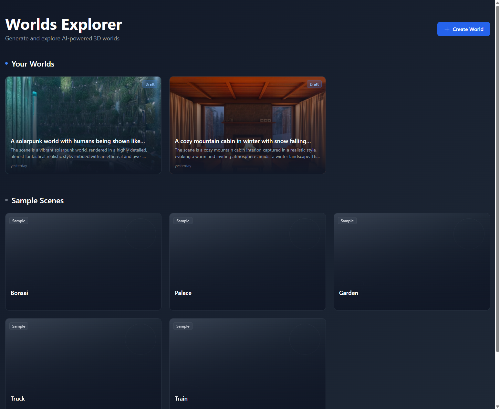
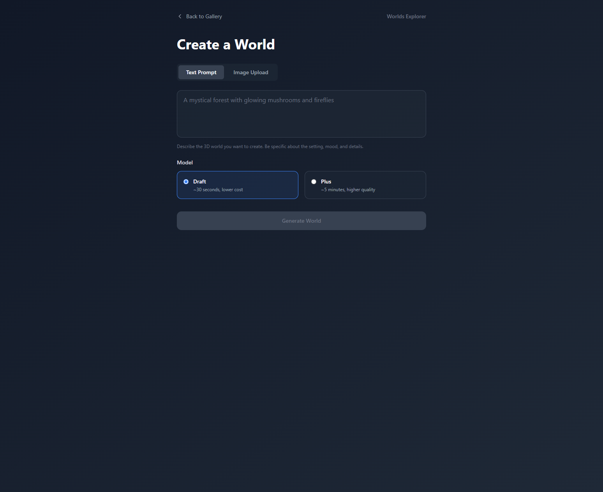
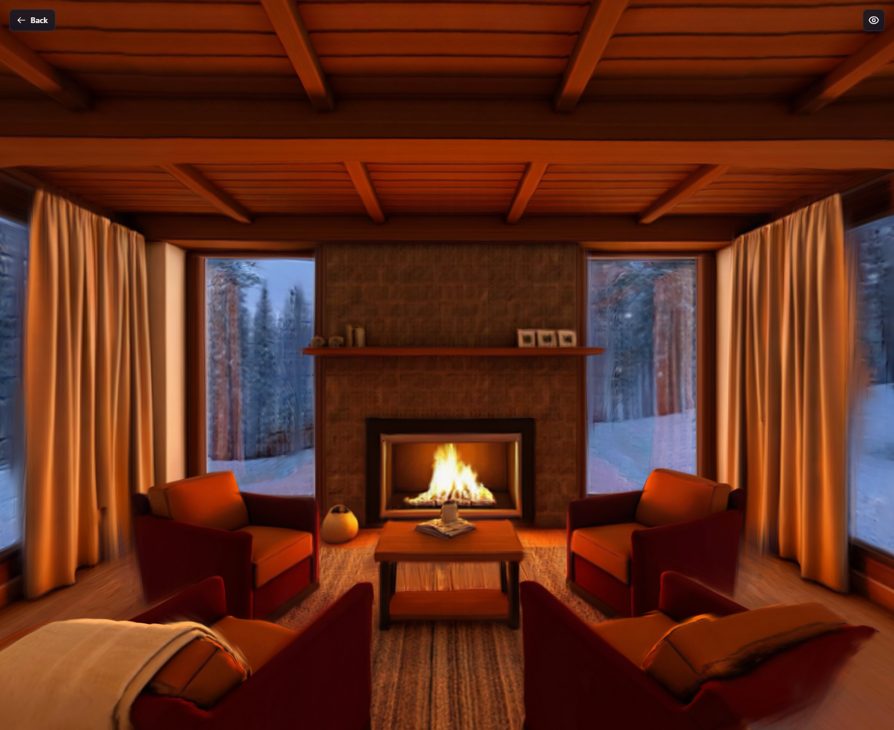
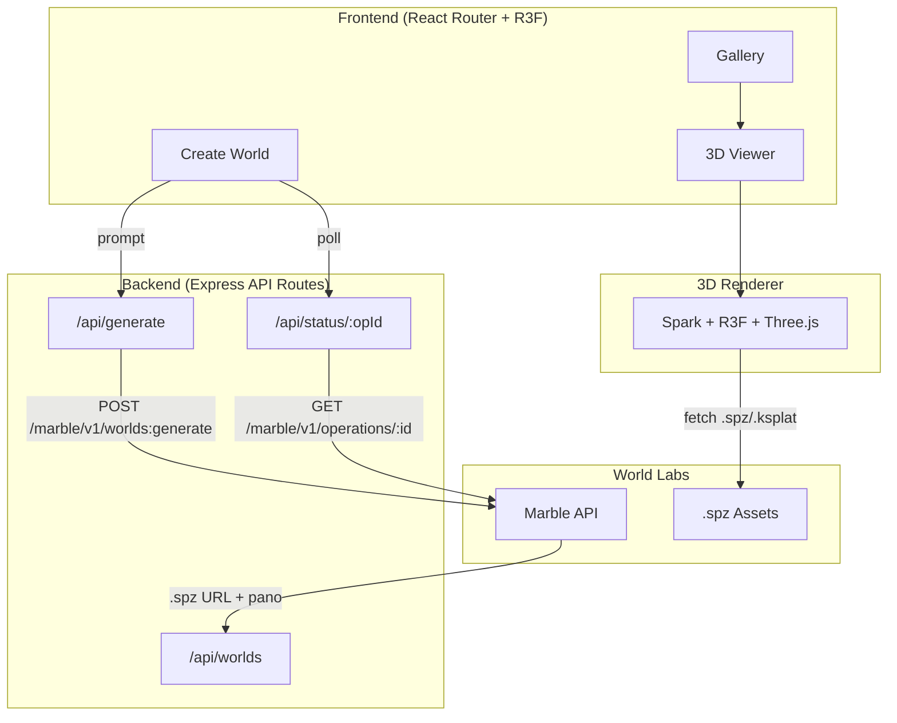

# Worlds Explorer

**Generate, explore, and share AI-powered 3D worlds.**

Built with [World Labs Marble API](https://docs.worldlabs.ai/api) and [Spark](https://sparkjs.dev/) renderer.

`worlds-explorer` is a product-focused 3D web app that turns world generation into a complete user flow: create a world, track generation progress, browse a gallery, and open each result in a shareable WebGL viewer.

## Why This Repo Matters

- Shows a full-stack product slice instead of an isolated 3D demo
- Uses World Labs tooling directly: Marble for generation and Spark for splat rendering
- Includes camera path authoring so recorded viewer motion can be replayed and exported as JSON
- Handles real browser/runtime constraints like SSR boundaries, SharedArrayBuffer headers, and mock-first API development
- Treats 3D worlds as shareable product artifacts, not just rendering experiments

## Demo

This repo is currently optimized for a fast local demo:

- `MOCK_API=true` gives a no-credit, end-to-end walkthrough of generation, polling, gallery, and viewer states
- the app runs locally at [http://localhost:3000](http://localhost:3000)
- screenshots are included below so reviewers can understand the flow before cloning

## Screenshots





## What It Does

Worlds Explorer is a full-stack web application that lets users generate photorealistic 3D worlds from text or image prompts using World Labs' Marble API, then explore them in an immersive WebGL viewer powered by Spark and React Three Fiber. Each world gets a shareable URL with rich social previews, and the viewer now supports camera path recording, playback, and JSON export for lightweight cinematic walkthroughs.

> *"This project explores 3D as a composable, shareable interface — worlds as artifacts that can be generated, inspected, and shared, not just rendered."*
>
> — Inspired by World Labs' ["3D as Code"](https://www.worldlabs.ai/blog/3d-as-code) philosophy

## Architecture



## Tech Stack

- **Framework**: [React Router v7](https://reactrouter.com/) (SSR) + [Vite](https://vitejs.dev/)
- **Server**: [Express](https://expressjs.com/) with COOP/COEP headers for SharedArrayBuffer
- **3D Rendering**: [Spark](https://sparkjs.dev/) + [React Three Fiber](https://docs.pmnd.rs/react-three-fiber) + [Three.js](https://threejs.org/)
- **Styling**: [Tailwind CSS](https://tailwindcss.com/)
- **Language**: TypeScript
- **API**: World Labs [Marble API](https://docs.worldlabs.ai/api) for world generation

## Engineering Notes

- [Architecture decisions](./ARCHITECTURE_DECISIONS.md)
- Mock-first API flow for credit-efficient iteration
- SSR shell with a client-only Spark viewer
- Cross-origin isolation headers for SharedArrayBuffer support

## Background

Previously built CAD-to-GLTF pipelines at Tesla; this project explores the next generation of 3D representations: Gaussian splats (`.spz`) generated by AI world models rather than traditional mesh-based workflows.

## Getting Started

### Prerequisites

- Node.js >= 20.0.0 (project uses Volta with Node 24.14.1)
- World Labs API key from [worldlabs.ai/developer](https://worldlabs.ai/developer)

### Installation

```bash
git clone https://github.com/morsmodr/worlds-explorer.git
cd worlds-explorer
npm install
```

### Configuration

Copy the example environment file:

```bash
cp .env.example .env
```

Edit `.env`:

```env
# Enable mock mode for development (no API credits used)
MOCK_API=true

# Your World Labs API key (required when MOCK_API=false)
WLT_API_KEY=your_api_key_here
```

### Development

**Mock mode** (recommended for development — no API credits used):

```bash
npm run dev
```

The app runs at [http://localhost:3000](http://localhost:3000). Mock mode simulates the Marble API with realistic delays and returns sample splat files.

**Real API mode** (uses credits):

```bash
# In .env, set:
# MOCK_API=false
# WLT_API_KEY=your_actual_key

npm run dev
```

### Production Build

```bash
npm run build
npm start
```

## Deployment

### Docker

```bash
docker build -t worlds-explorer .
docker run -p 3000:3000 -e MOCK_API=true worlds-explorer
```

For real API mode:

```bash
docker run -p 3000:3000 \
  -e MOCK_API=false \
  -e WLT_API_KEY=your_api_key \
  worlds-explorer
```

### COOP/COEP Headers

The app requires `Cross-Origin-Embedder-Policy: require-corp` and `Cross-Origin-Opener-Policy: same-origin` headers for SharedArrayBuffer support (needed by Spark's WebGL renderer). These are configured in `server.js` and the Vite dev server.

If deploying behind a reverse proxy, ensure these headers are not stripped.

## Credit Budget Strategy

World Labs provides 7,000 free credits. This project uses a **mock-first development approach**:

1. Build and test the entire UI flow with `MOCK_API=true` (0 credits)
2. Run integration smoke test with real API (~300 credits)
3. Generate demo content for the gallery (~2,000 credits)
4. Keep buffer for iterations (~4,700 credits remaining)

Use `Marble 0.1-mini` (~150-330 credits, ~30s) for development. Reserve `Marble 0.1-plus` (~1,500 credits, ~5min) for final showcase content.

## Project Structure

```
app/
├── components/
│   ├── spark-canvas.tsx    # R3F + Spark renderer
│   ├── viewer-hud.tsx      # Viewer overlay UI
│   └── world-card.tsx      # Gallery card component
├── lib/
│   ├── marble-client.ts    # Marble API client (with mock mode)
│   └── worlds-store.ts     # JSON file store for world metadata
├── routes/
│   ├── _index.tsx          # Gallery home page
│   ├── create.tsx          # Create world page
│   ├── world.$id.tsx       # Viewer page
│   ├── api.generate.tsx    # Generation API proxy
│   ├── api.status.$operationId.tsx  # Polling API
│   └── api.worlds.tsx      # Worlds listing API
└── scenes.ts               # Sample scene configurations
```

## License

MIT
